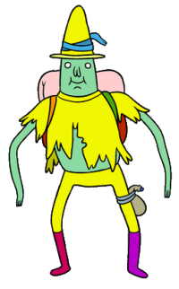
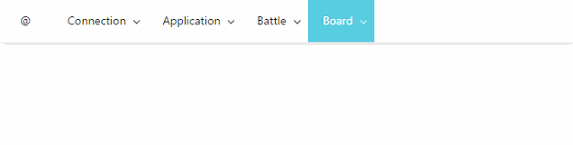
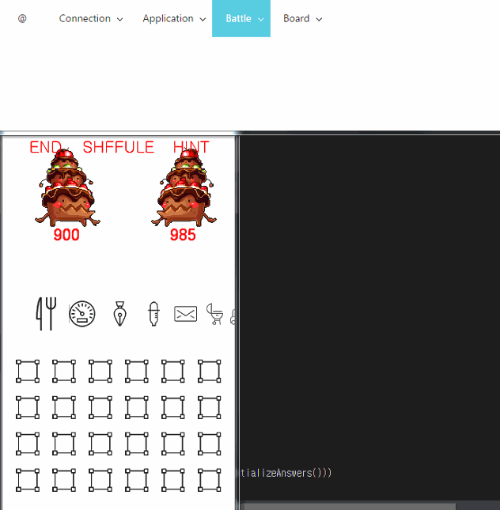

MagicShow
====

<br>
__API 디자인 스케치용 레포, 구현, 릴리즈 미포함__
<br>
__MagicShow__는 게임 프로토타이핑 과정에 있어서 여러가지 효과 변경/테스트용 치트키/씬 변경을 쉽게 도와줍니다.<br>
조그만거 뭐 하나 바꿨다고 껏다가 다시 빌드하지 마세요.
<br>
__No server/host setup required__

Demo
----

<br><br>
__값 변경하기___<br>

<br><br>
__액션 스위치__<br>


Supported Engine
----
* __cocos2d-x__

Todo
----
* Unity : 유니티는 없어도 될듯

API
----
```json
{
  "TAB_NAME" : {
  },
  "BATTLE" : {
  },
  "SHOP" : {
  }
}
```

```cpp
class MyGameObject : Magic::Listener {
public:
  virtual void onConfigurationChanged() {
    /* impl */
  }
}
```